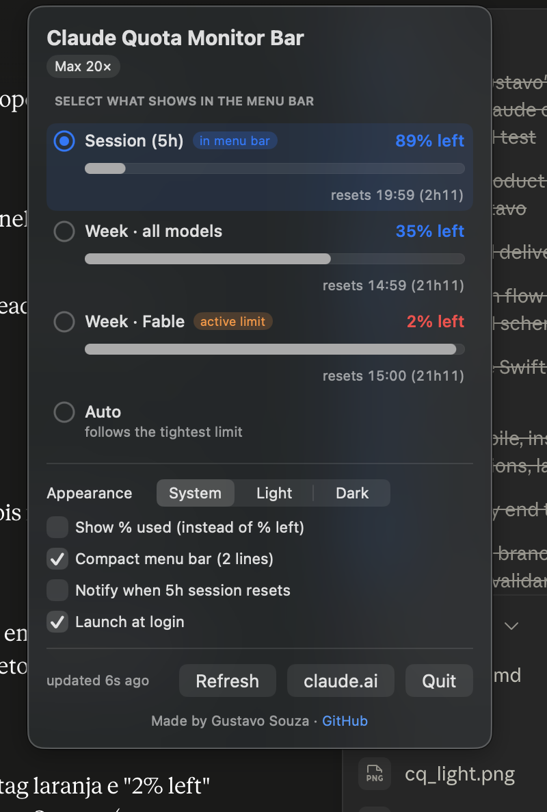

# Claude Quota Monitor Bar

Sua quota do Claude na menu bar do Mac. Sem abrir Settings → Usage nunca mais.

[](LICENSE)


**Em cima**: % restante do limite escolhido. **Embaixo**: tempo até o reset. Clique para ver os três limites (sessão de 5h, semana todos os modelos, semana por modelo ex. Fable) e escolher qual deles aparece na barra, com notificação opcional quando a sessão reseta.



## Por quê

No plano Max, os limites (sessão de 5h + semanal por modelo) definem qual modelo usar e quando. Checar isso exige três cliques até as configurações do Claude. Agora é um relance ao lado do relógio: o texto fica sempre branco e nítido; o símbolo % fica laranja a partir de 75% de uso e vermelho a partir de 90%, e um ponto vermelho aparece quando o limite semanal do modelo top aperta.

## Recursos

- **Escolha o que aparece na barra**: clique em qualquer um dos três limites no painel (ou em "Auto", que segue o mais apertado). A seleção é um radinho embutido na própria linha, sem UI duplicada.
- **Light e Dark**: segue o sistema por padrão, com override manual (System / Light / Dark) no painel.
- **Compacto**: 2 linhas empilhadas (% em cima, countdown embaixo) ou 1 linha, à sua escolha.
- **Sem susto de rate limit**: retries curtos, pausa curta e cache do último snapshot.

## Requisitos

macOS 13+, assinatura Claude (Pro/Max). O app compila localmente em ~5s (sem certificado da Apple não há como distribuir binário sem o Gatekeeper reclamar — e assim você pode auditar cada linha do que roda).

## Instalar

### Opção 1 — peça ao seu Claude (recomendado)

No Cowork ou Claude Code:

> Clone https://github.com/gustavohsouza/claudequota e instale seguindo o INSTALL-CLAUDE.md

### Opção 2 — manual

```bash
git clone https://github.com/gustavohsouza/claudequota.git
cd claudequota
./install.command
```

O script compila, instala em /Applications, garante o Claude Code CLI e abre o login da sua conta Claude (um clique em Authorize no browser). Depois, clique no item da menu bar e ative "Launch at login".

## Como funciona

1. Consulta `api.anthropic.com/api/oauth/usage` a cada 80s — endpoint read-only de metadados, **não consome quota**. Countdown recalculado localmente a cada 20s. Backoff em rate limit e cache do último snapshot.
2. O plano exibido (Max 5×, 20×, Pro) vem ao vivo do endpoint `profile`, não de cache congelado.
3. Autenticação: reutiliza a credencial oficial do Claude Code CLI (Keychain, serviço `Claude Code-credentials`) e a renova automaticamente. Seu token nunca sai do seu Mac.
4. Um único arquivo Swift, zero dependências, ~0% CPU.

## Solução de problemas

- `CQ ⚠` na menu bar → `claude auth login --claudeai` no Terminal, depois Refresh no painel.
- Estado bruto para debug: `~/Library/Application Support/ClaudeQuota/state.json`.

## Desinstalar

Quit no painel e `rm -rf "/Applications/Claude Quota Monitor Bar.app"`. A credencial pertence ao Claude Code e permanece.

## Licença

CC BY-NC-SA 4.0 (Creative Commons Attribution-NonCommercial-ShareAlike 4.0). Você pode usar, distribuir e modificar livremente para fins **não comerciais**. Qualquer redistribuição ou derivado deve **creditar Gustavo Souza**, linkar este repositório e permanecer sob a mesma licença. Detalhes em [LICENSE](LICENSE).

## Créditos

Feito 100% com Claude (Cowork): PRD, engenharia reversa do fluxo OAuth, código, testes, screenshots e este README. Humano envolvido: os cliques em Authorize.
